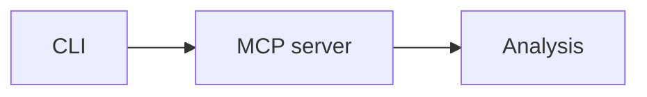
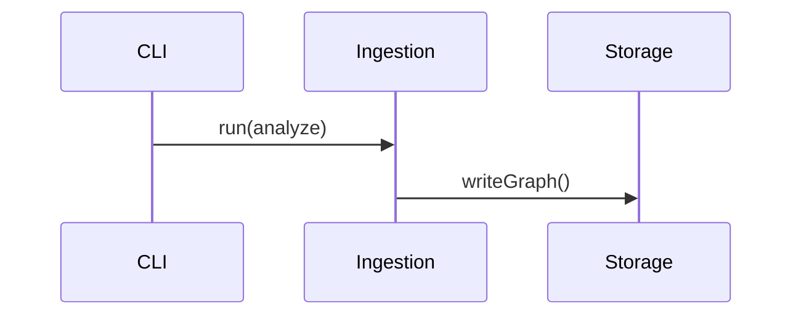
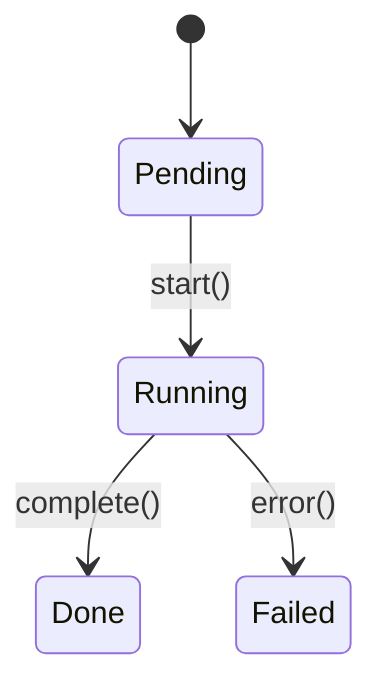
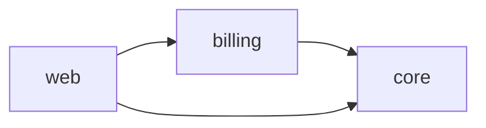
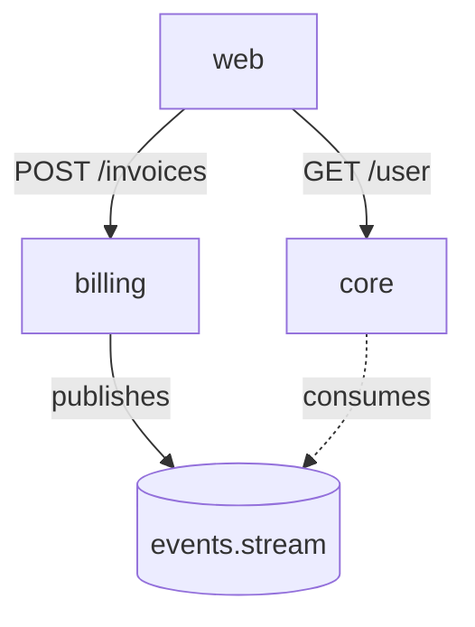

# document-templates — per-file structural templates

One template per file the artifact factory emits. Subagents consult this reference when drafting; the skill orchestrator uses it to validate Phase E output.

## Conventions

- H1 = identifier (repo name, module name, API section). No decorative titles.
- No YAML frontmatter on any generated doc.
- Every factual claim has a backtick citation (`path:LOC` or `repo:path:LOC`).
- Mermaid only for diagrams; fenced with ```mermaid.
- "See also" footer is written by Phase E, not by subagents.

## architecture/system-overview.md

```markdown
# <repo> · System overview

2-paragraph narrative of what the repo does and how the pieces fit.
Cites `packages/foo/src/index.ts` (200 LOC) style file references.

## Stack

| Layer | Technology | Source |
|---|---|---|
| Runtime | Node 22 | `package.json:7` |
| Storage | DuckDB + hnsw_acorn | `packages/storage/src/index.ts:12` |
| ... | ... | ... |

## Module map



One Mermaid `flowchart LR`, ≤ 20 nodes.
```

## architecture/module-map.md

```markdown
# <repo> · Module map

## <module-1 name>

One-paragraph description. Cites `path:LOC`.

- `packages/module-1/src/index.ts` (320 LOC)
- `packages/module-1/src/types.ts` (88 LOC)
- ... top 8 files ...

## <module-2 name>

(same pattern)

## Supporting code

Everything that didn't fit into a named module.
```

## architecture/data-flow.md

```markdown
# <repo> · Data flow

## Flow 1: <process-name>

1. Entry point at `packages/cli/src/commands/analyze.ts:14`.
2. Dispatches to `packages/ingestion/src/phases/*.ts`.
3. ... numbered steps, each with a backtick citation ...



## Flow 2: <process-name>
(same pattern, max 3 flows total)
```

## reference/public-api.md

```markdown
# <repo> · Public API

## <exported-symbol-1>

```ts
export function doThing(input: InputShape): OutputShape
```

One-sentence description. `packages/foo/src/index.ts:42`.

## <exported-symbol-2>
(same pattern, top 30 exports)
```

## reference/cli.md (conditional)

```markdown
# <repo> · CLI

The `codehub` CLI has the following subcommands.

## analyze

```
codehub analyze [--incremental] [--quiet]
```

Runs the ingestion pipeline. `packages/cli/src/commands/analyze.ts:1`.

Flags:
- `--incremental` — skip unchanged files. `packages/cli/src/commands/analyze.ts:22`.
- `--quiet` — suppress progress output.

## status
(same pattern)
```

## reference/mcp-tools.md (conditional)

```markdown
# <repo> · MCP tools

## list_repos

Enumerates indexed repos on this machine. No inputs.

Returns `{ repos: [{ name, graph_hash, indexed_at }] }`.

Source: `packages/mcp/src/tools/list-repos.ts:1`.

## query
(same pattern, one H2 per tool)
```

## behavior/processes.md

```markdown
# <repo> · Processes

## <process-1 name>

Entry point: `packages/foo/src/entry.ts:10`.

1. Step 1. `path:LOC`
2. Step 2. `path:LOC`
3. Step 3. `path:LOC`

### Related

- `packages/foo/src/helper-1.ts`
- `packages/foo/src/helper-2.ts`

## <process-2 name>
(same pattern, max 8 processes)
```

## behavior/state-machines.md (conditional)

```markdown
# <repo> · State machines

## <machine-1 name>



Defined at `packages/foo/src/state.ts:15`.
```

## analysis/risk-hotspots.md

```markdown
# <repo> · Risk hotspots

Top 12 files by combined risk score (30-day window).

| File | Trend | Open findings | Top owner | Citation |
|---|---|---|---|---|
| packages/foo/src/bar.ts | ↑ rising | 3 warn, 1 error | alice@ | `packages/foo/src/bar.ts` (245 LOC) |
| ... | ... | ... | ... | ... |

## Per-file drill-down

### packages/foo/src/bar.ts

What's there: (2-sentence summary).
Recent activity: (from risk_trends).
Owners: alice@ (68%), bob@ (22%).
Findings: 3 warn, 1 error — see `list_findings` output.
```

## analysis/ownership.md

```markdown
# <repo> · Ownership

| Folder | Top owner | Share | Total contributors |
|---|---|---|---|
| packages/mcp | ... | 72% | 4 |
| ... | ... | ... | ... |

## Single points of failure

Paths where the top owner has > 70% of commits.

- `packages/mcp/src/resources/` — alice@ (82%). No secondary reviewer.
- ... (each with a 1-sentence mitigation suggestion)
```

## analysis/dead-code.md

```markdown
# <repo> · Dead code

## Unreferenced exports

| Symbol | Path | Last modified |
|---|---|---|
| oldHelper | packages/foo/src/helpers.ts:120 | 2024-11-03 |
| ... | ... | ... |

## Unreferenced files

| File | Lines | Last modified |
|---|---|---|
| packages/legacy/src/deprecated.ts | 88 | 2024-08-12 |

## Dead imports

| Path | Symbol | Imported from |
|---|---|---|
| packages/foo/src/index.ts:3 | legacy | packages/legacy |
```

## diagrams/ — three files

Each has exactly one Mermaid diagram (plus optional Legend table when node count was truncated). See `mermaid-patterns.md` for idioms.

- `diagrams/architecture/components.md` — `classDiagram`.
- `diagrams/behavioral/sequences.md` — up to 3 `sequenceDiagram` blocks.
- `diagrams/structural/dependency-graph.md` — `flowchart LR`.

## cross-repo/ — group mode only

### cross-repo/portfolio-map.md

```markdown
# <group> · Portfolio map

2-paragraph narrative of the group's shape (domain, member purposes, shared contracts).

## Member repos



## Repos

### billing — <one-line description>

Citations: `billing:packages/api/src/index.ts:1` (120 LOC).
[See billing docs →](../../billing/.codehub/docs/README.md)

### core — <one-line description>
(same pattern)
```

### cross-repo/contracts-matrix.md

```markdown
# <group> · Contracts matrix

Rows = producers; columns = consumers. Cell = number of contracts.

|       | billing | core | web |
|-------|---------|------|-----|
| billing | —     | 3    | 5   |
| core  | —       | —    | 12  |
| web   | —       | —    | —   |

## Notable contracts

- `billing:packages/api/src/handlers/invoice.ts:45` ← consumed by `web:packages/checkout/src/api.ts:22`.
- ... (top 10 with direction + path + both-ends citations)
```

### cross-repo/dependency-flow.md

```markdown
# <group> · Dependency flow


```

## README.md (Phase E output)

```markdown
# <repo-or-group> · Generated documentation

*Prose is LLM-generated; structure is graph-derived. Phase E cross-references are deterministic.*

Generated at: 2026-04-27T18:12:04Z
Graph hash: sha256:…

## Structure

- [Architecture](architecture/system-overview.md)
- [Reference](reference/public-api.md)
- [Behavior](behavior/processes.md)
- [Analysis](analysis/risk-hotspots.md)
- [Diagrams](diagrams/architecture/components.md)
- [Cross-repo](cross-repo/portfolio-map.md)    ← group mode only

## Refreshing

Run `/codehub-document --refresh` to regenerate stale sections only.
Run `/codehub-document` without flags for a full regen.
```
