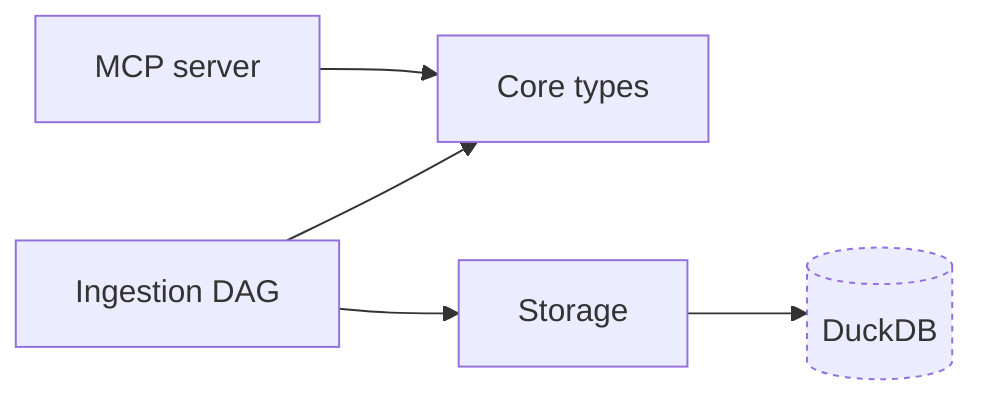
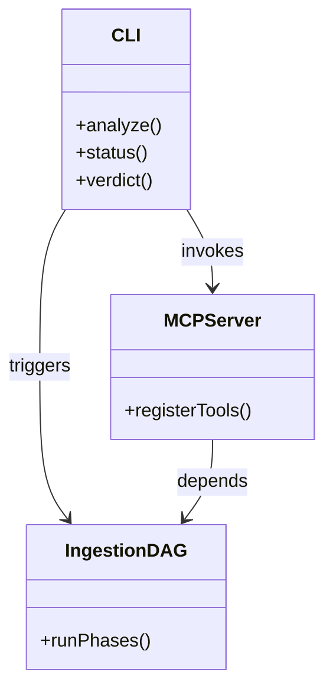
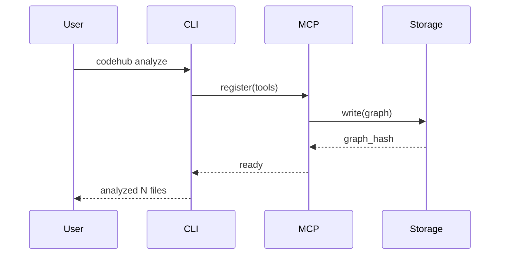
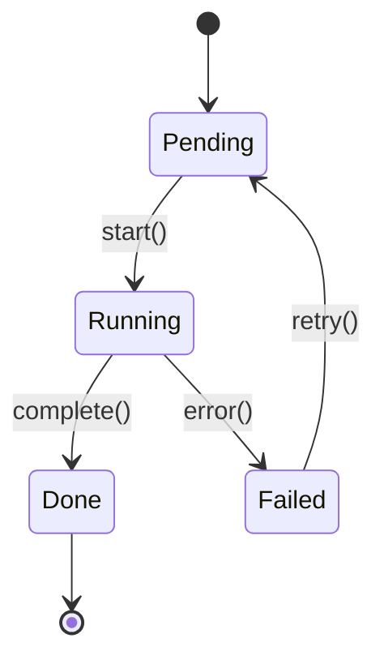
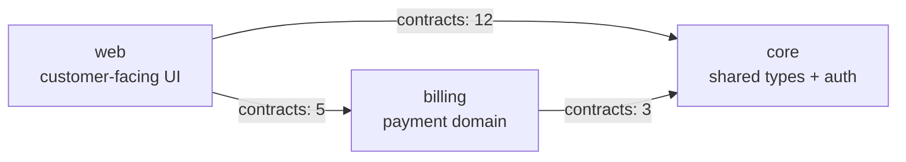
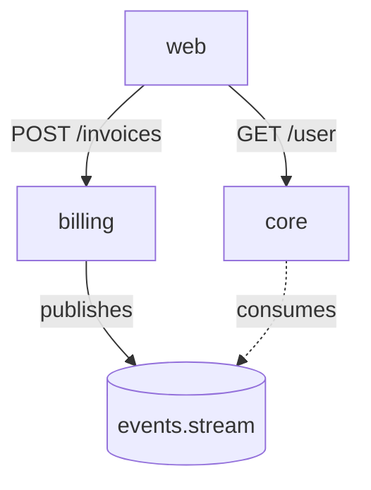

# mermaid-patterns — diagram idioms

One diagram type per artifact. Diagrams capped at 20 nodes; overflow goes into a Legend table, never into the diagram. All Mermaid fenced with ```mermaid.

No SVG or PNG generation. Ever.

## Dependency graph — `flowchart LR`

For `diagrams/structural/dependency-graph.md`. Internal communities as filled nodes; external deps as leaf nodes with a distinct style.



**Rules:**
- Max 20 nodes.
- Internal communities: plain rectangles with brackets.
- External deps: parenthesized shape `node[(name)]:::external` + dashed stroke class.
- Overflow nodes go into a Legend table below the fenced block.

## Component view — `classDiagram`

For `diagrams/architecture/components.md`. Shows has-a and uses relationships between top components.



**Rules:**
- Max 8 components.
- 3–5 methods per class, chosen by call-count from the graph.
- Relationships labeled with a one-word verb.

## Top process — `sequenceDiagram`

For `diagrams/behavioral/sequences.md`. One diagram per top process, up to 3.



**Rules:**
- 4–8 participants per diagram.
- Lifelines in dispatch order.
- Solid arrows for calls, dashed for returns.

## State machine — `stateDiagram-v2`

For `behavior/state-machines.md` (conditional).



**Rules:**
- Every transition labeled with the triggering event.
- `[*]` entry/exit always present.

## Data flow — `flowchart TB`

For `architecture/data-flow.md`.

```mermaid
flowchart TB
  source[Repo files]
  parse[tree-sitter parser]
  graph[DuckDB graph]
  embed[ONNX embedder]
  query[MCP query]
  source --> parse
  parse --> graph
  parse --> embed
  embed --> graph
  query --> graph
```

**Rules:**
- Top-to-bottom flow (`TB`).
- Stores as rectangular bracket nodes; processes as simple bracket nodes; external interfaces as parenthesized nodes.

## Cross-repo portfolio — `flowchart LR`

For `cross-repo/portfolio-map.md` (group mode).



**Rules:**
- Node labels include a one-line domain description (use `<br/>` for the second line).
- Edge labels include the contract count from `group_contracts`.

## Cross-repo dependency flow — `flowchart TB`

For `cross-repo/dependency-flow.md` (group mode).



**Rules:**
- Nodes are repos; events/queues are parenthesized shape.
- Edge labels are the HTTP verb + path (for routes) or the event type (for streams).
- Dashed edges for async/pub-sub; solid for synchronous calls.

## Legend tables

When a diagram exceeds 20 nodes, keep the top-20-by-edge-count in the diagram and add a Legend table immediately below:

```markdown
## Legend (overflow)

These nodes were elided from the diagram above for readability:

| Node | Edges | Reason for elision |
|---|---|---|
| peripheral-module-1 | 3 | Too few edges |
| deprecated-thing | 2 | Slated for removal |
```

## Diagram label length rules

Mermaid breaks on long labels. Keep them short:

- Node labels: ≤ 20 characters (excluding explicit `<br/>`).
- Edge labels: ≤ 15 characters.
- Use abbreviations liberally; spell the full name in a Legend table.
