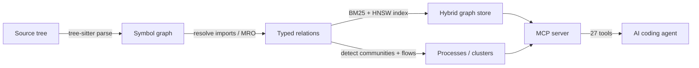

# OpenCodeHub

[](https://github.com/theagenticguy/opencodehub/actions/workflows/ci.yml)
[](https://github.com/theagenticguy/opencodehub/actions/workflows/codeql.yml)
[](https://securityscorecards.dev/viewer/?uri=github.com/theagenticguy/opencodehub)
[](./LICENSE)
[](https://modelcontextprotocol.io)

> **Code intelligence for AI coding agents, under Apache-2.0, on an all-OSS stack.**

## Why this exists

AI coding agents have a structural blind spot: they can see a file, but
they can't see the *graph* the file lives in. This causes three recurring
failures that anyone who has shipped with a coding agent has lived through:

1. **Missed dependencies.** The agent renames a function and doesn't
   touch the 14 callers it can't see, because `grep` found 3.
2. **Broken call chains.** The agent changes a return shape, the handler
   two hops downstream explodes at runtime, and neither the agent nor
   its tests flag it — the relationship was never in context.
3. **Blind edits.** The agent edits a critical-path function without
   knowing it's on the hot path of 8 production flows, because nothing
   computed that ahead of time.

Grep is textual. Language servers are per-file. Embeddings are lossy.
None of them answer the questions an agent actually needs answered
*before* it writes a diff: **what breaks if I change this? what depends
on this? where does this data flow?**

## What OpenCodeHub solves

OpenCodeHub indexes your repository into a **hybrid knowledge graph**
(structural + semantic) and exposes it to agents over the **Model
Context Protocol**. Agents stop guessing and start asking:

```
impact(target: "validateUser")
→ direct callers: 14 · affected processes: 3 · risk: HIGH
→ fix direction: upstream (input validation boundary)

query("auth token refresh flow")
→ process: auth.refresh_token (7 steps, 4 files)
→ process: oauth.rotate_session (5 steps, 3 files)

context(name: "PaymentProcessor")
→ callers · callees · processes it participates in · ACCESSES edges · docstrings
```

The graph is **precomputed at index time** — clustering, execution-flow
tracing, and blast-radius analysis are done once, not at every query.
That means agents get complete relational context in one tool call, not
ten round-trips.



## Design choices worth knowing

| Choice | Why it matters |
|---|---|
| **Apache-2.0, end to end** | Every runtime dep is OSI-approved permissive. No PolyForm, BSL, Commons Clause, Elastic v2, GPL, or AGPL. You can fork, embed, and ship commercial products on top without a license-review detour. |
| **Local-first, offline-capable** | `codehub analyze --offline` opens zero sockets. Your code never leaves your machine. No telemetry. |
| **Deterministic indexing** | Identical inputs produce a byte-identical graph hash. Reproducible. Auditable. Cacheable in CI. |
| **MCP-native** | Works out-of-the-box with Claude Code, Cursor, Codex, Windsurf, OpenCode. The MCP server is the primary interface; CLI exists for scripts and CI. |
| **Embedded storage** | DuckDB + `hnsw_acorn` (filter-aware HNSW via ACORN-1 + RaBitQ) + `fts` (BM25). One file. No daemon. No database to operate. |
| **14 languages at GA** | TypeScript, JavaScript, Python, Go, Rust, Java, C#, C, C++, Ruby, Kotlin, Swift, PHP, Dart — via tree-sitter native bindings (WASM fallback for the web surface). |

## Quick start

**Requirements:** macOS, Linux, or Windows; Node 20+; pnpm 10+; Python
3.12 (for the eval harness); `mise` recommended to manage them.

```bash
git clone https://github.com/theagenticguy/opencodehub
cd opencodehub
mise install
pnpm install --frozen-lockfile
pnpm run check          # lint + typecheck + test + banned-strings
```

Point your AI coding agent at the MCP server. With Claude Code:

```bash
# configure the MCP server (once)
claude mcp add opencodehub -- node /path/to/opencodehub/packages/mcp/dist/index.js

# index your repo
codehub analyze

# your agent can now call impact, query, context, detect_changes, rename, ...
```

## MCP tool surface (27 tools)

| Tool | Purpose |
|---|---|
| `query` | Process-grouped code intelligence — execution flows related to a concept |
| `context` | 360-degree symbol view — callers, callees, processes, ACCESSES edges |
| `impact` | Blast radius — what breaks at depth 1/2/3 with confidence + risk tier |
| `detect_changes` | Git-diff impact — what do your current changes affect |
| `rename` | Multi-file coordinated rename with confidence-tagged edits |
| `route_map` / `api_impact` / `shape_check` / `tool_map` | HTTP route & MCP tool intelligence |
| `group_query` | BM25-fused search across a group of repos |
| `list_repos` · `sql` | Registry & escape-hatch SQL (read-only, timeout-guarded) |
| …and 16 more | Communities, processes, SBOM, SARIF, verdict, etc. |

Full docs in `docs/`.

## Status

**v0.1.0 — initial public release.** The codebase is feature-complete
along the scope described below, but the project is brand-new on
GitHub and the API surface is not yet stable.

While on `0.x`, **any release may contain breaking changes** to the
graph schema, MCP tool shapes, CLI flags, or storage layout. Breaking
changes are called out with `!` or a `BREAKING CHANGE:` footer in the
commit log and summarised in each release's generated CHANGELOG.

`1.0.0` will be cut when we commit to schema + tool-surface stability.

## Supply-chain posture

- **CycloneDX SBOM** at [`SBOM.cdx.json`](./SBOM.cdx.json) (regenerated on every release)
- **Third-party license inventory** at [`THIRD_PARTY_LICENSES.md`](./THIRD_PARTY_LICENSES.md)
- **CI gates**: license allowlist, banned-strings grep, OSV vulnerability scan, CodeQL SAST, OpenSSF Scorecard
- **Zero open CVEs** on the lockfile at release time

## Contributing

See [`CONTRIBUTING.md`](./CONTRIBUTING.md). Issues and discussions welcome;
PRs must pass `pnpm run check` and have a filled-out PR template.

## License

Apache-2.0. See [`LICENSE`](./LICENSE) and [`NOTICE`](./NOTICE).
