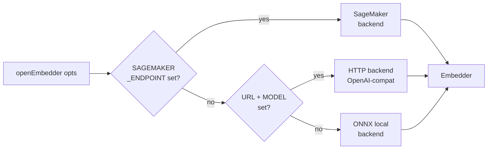

Embeddings are optional. When enabled, the pipeline produces vectors
at three granularities (symbol, file, community) from one of three
backends (ONNX local, HTTP/OpenAI-compat, SageMaker) and persists
them in the `embeddings` table in `store.sqlite`, searched by exact
brute-force cosine KNN. This page covers the backend cascade, the tier model, the
storage shape, and why `WHERE granularity='symbol'` does not collapse
recall.

The persisted modelId is part of the store metadata (ADR 0014). A
query path that mixes a different embedder than the one that produced
the stored vectors refuses with `EMBEDDER_MISMATCH` unless the caller
passes the documented force flag — silent cosine misranking from
backend swaps is the failure mode this guards against.

## Backend cascade

`openEmbedder(opts)` selects exactly one backend. The cascade is, in
order, **SageMaker → HTTP → ONNX**:

1. If `CODEHUB_EMBEDDING_SAGEMAKER_ENDPOINT` is set, the SageMaker
   backend runs. SigV4 auth, TEI-native wire format (raw
   `list[list[float]]`, not OpenAI-wrapped), dynamic-import + credential
   soft-fail.
2. Else if `CODEHUB_EMBEDDING_URL` + `CODEHUB_EMBEDDING_MODEL` are set,
   the generic OpenAI-compatible HTTP backend runs. Base URL gets
   `/embeddings` appended; 30 s timeout, 2 retries.
3. Else the local ONNX backend runs. Deterministic path; weights
   loaded from the setup directory managed by
   `@opencodehub/embedder/paths`.

The **offline invariant** is enforced in three places
(`openEmbedder`, `tryOpenHttpEmbedder`, and the ingestion phase):
remote-env-var-set together with `offline=true` throws rather than
silently falling through.

## Per-backend details

### ONNX local

The default. Deterministic 320-dim embeddings from
`codefuse-ai/F2LLM-v2-80M` (a Qwen3-0.6B-Base derivative, 80.1M params).
Last-token pooling and L2 normalization are baked into the ONNX graph,
which emits a single already-unit-length output `embedding` of shape
`[B, 320]`. The custom ONNX export is hosted as a SHA256-pinned GitHub
release asset; weights live in the directory managed by
`@opencodehub/embedder/paths`; missing weights throw
`EmbedderNotSetupError`, which `codehub setup --embeddings` fixes.

**Query/document asymmetry.** Documents are embedded raw. Queries get an
`Instruct: {instruction}\nQuery: {query}` prefix (instruction: "Given a
code search query, retrieve the most relevant code snippet.") via the
`embedQuery()` method on the Embedder interface, applied only at the
hybrid-search query seam.

A Piscina worker pool (`embedder-pool.ts`) spins up when
`embeddingsWorkers >= 2`, running ONNX inference across worker
threads. Single-worker mode is the default and is good enough for
most repos.

### HTTP (OpenAI-compatible)

A generic path for any endpoint that speaks the OpenAI embeddings
wire format:

- `CODEHUB_EMBEDDING_URL` — base URL (`/embeddings` is appended).
- `CODEHUB_EMBEDDING_MODEL` — model id passed through verbatim.
- `CODEHUB_EMBEDDING_DIMS` — dimensions (default 320).
- `CODEHUB_EMBEDDING_API_KEY` — bearer token.

30 s timeout, 2 retries with 1 s backoff.

### SageMaker

Runtime client is dynamically imported, so a repo that does not use
SageMaker does not pay the AWS SDK bundle cost. Missing credentials
trigger a credential soft-fail (`CredentialsProviderError`,
`NoCredentialsError`, `ExpiredTokenException`) rather than an
exception — the phase reports `skippedReason: "no-credentials"` and
carries on.

ModelId stamping is explicit to prevent silent cross-backend
pollution of the `embeddings.model` column: SageMaker rows carry
`F2LLM-v2-80M/sagemaker:<endpointName>`, ONNX rows carry
`F2LLM-v2-80M/fp32`, HTTP rows pass the configured model id
through. See the durable lesson linked below for the full pattern
(dynamic import, structural-typing seam, 413 split-retry).

## Three tiers

The `EmbeddingGranularity` discriminator is `"symbol" | "file" |
"community"`. Each tier feeds one kind of query:

| Tier      | Unit                                                 | Character cap                    |
|-----------|------------------------------------------------------|----------------------------------|
| symbol    | Callable or declaration (Function, Method, Constructor, Route, Tool, Class, Interface) | 1200 (body only; fused signature + summary add on top) |
| file      | One vector per scanned file                          | 8192 tokens (`FILE_CHAR_CAP = 8192 * 4`) |
| community | One vector per Community node                        | N/A — built from member symbols  |

The default is `["symbol"]` to preserve v1.0 behavior. File and
community tiers opt in via `PipelineOptions.embeddingsGranularity`.

Symbol-tier fusion combines `signature + summary + body` into the
embedded text when an LLM summary exists for the node. See
[Summarization and fusion](/opencodehub/architecture/summarization-and-fusion/)
for the formula.

## Single embeddings table

The storage shape is deliberately simple: one `embeddings` table inside
`store.sqlite`, with the `vector` stored as a BLOB (BLOB-exact
`Float32Array`) and one `granularity` column as a discriminator. All
three tiers share this table. Granularity filtering is pushed as
`WHERE e.granularity IN (…)` into the query predicate, so selective
filters narrow the candidate set rather than being applied after the
fact.

## Filter-aware vector search

Vector search runs directly over the `embeddings` table with the
predicate applied in the SQL query, so filters like
`WHERE language='python'` or `WHERE granularity='community'` actually
return results. A naive post-filter walks the top-k by cosine
distance and drops rows that fail the predicate, which collapses to
zero recall under selective filters; querying with the predicate
inline avoids that by construction.

The default is a brute-force KNN over the stored BLOB vectors, which is
exact and adds zero native dependencies. `node:sqlite` exposes a
`loadExtension` seam for `sqlite-vec` if brute-force is ever outgrown;
that is a deferred fast-follow, not a shipping requirement.

## Configuration knobs

- `PipelineOptions.embeddings: boolean` — master on/off (default off).
- `PipelineOptions.embeddingsVariant: "fp32" | "int8"` — ONNX variant.
- `PipelineOptions.embeddingsModelDir` — override ONNX weights dir.
- `PipelineOptions.embeddingsGranularity` — tier selection (default
  `["symbol"]`).
- `PipelineOptions.embeddingsWorkers` — Piscina pool size for ONNX.
- `PipelineOptions.embeddingsBatchSize` — default 32.
- `SqliteStoreOptions.embeddingDim` — default 320.
- Env vars: `CODEHUB_EMBEDDING_SAGEMAKER_ENDPOINT` / `_REGION` /
  `_MODEL` / `_DIMS`; `CODEHUB_EMBEDDING_URL` / `_MODEL` / `_DIMS` /
  `_API_KEY`.

## Gotchas

- **ONNX fallback on silent SageMaker failure is blocked.** A
  remote-env-var-set + offline=true combination throws. A missing
  SageMaker endpoint with no env vars just picks ONNX — that is the
  intended cascade, not a failure.
- **No-embeddings is a real state.** When embeddings were never
  computed (the default, or an air-gapped / offline run), vector search
  returns no rows and surfaces a warning. This is expected, not an
  exception; lexical BM25 search still works.
- **Graph-hash independence.** The embeddings phase does not
  contribute to `graphHash` — embeddings are optional and
  probabilistic across backends. Gate 10 (the embeddings determinism
  gate) is advisory-only for this reason.
- **Content-hash keying.** `hashText(granularity, text)` is
  `sha256(<granularity>\0<sourceText>)`. Changing granularity
  changes the hash, so the same text embedded at two tiers produces
  two distinct cache rows.

## Further reading

- [ADR 0019 — Single-file SQLite storage](https://github.com/theagenticguy/opencodehub/blob/main/docs/adr/0019-single-file-sqlite-storage.md)
  — where the `embeddings` table lives and why there is no native binding.
- [ADR 0004 — Hierarchical embeddings](https://github.com/theagenticguy/opencodehub/blob/main/docs/adr/0004-hierarchical-embeddings.md)
  — one table, three granularities, one discriminator column.
- [Summarization and fusion](/opencodehub/architecture/summarization-and-fusion/)
  — where the symbol-tier text comes from.
- Durable lesson: `api-patterns/sagemaker-embedder-backend.md` —
  dynamic-import + credential soft-fail + structural-typing seam +
  modelId stamping + 413 split-retry.
