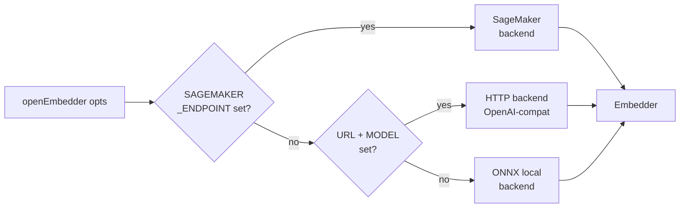

Embeddings are optional. When enabled, the pipeline produces vectors
at three granularities (symbol, file, community) from one of three
backends (ONNX local, HTTP/OpenAI-compat, SageMaker) and persists
them in one DuckDB table served by one HNSW index. This page covers
the backend cascade, the tier model, the storage shape, and why
`WHERE granularity='symbol'` does not collapse recall.

## Backend cascade

`openEmbedder(opts)` selects exactly one backend. The cascade is, in
order, **SageMaker → HTTP → ONNX**:

1. If `CODEHUB_EMBEDDING_SAGEMAKER_ENDPOINT` is set, the SageMaker
   backend runs. SigV4 auth, TEI-native wire format (raw
   `list[list[float]]`, not OpenAI-wrapped), dynamic-import + credential
   soft-fail.
2. Else if `CODEHUB_EMBEDDING_URL` + `CODEHUB_EMBEDDING_MODEL` are set,
   the generic OpenAI-compatible HTTP backend runs. Base URL gets
   `/embeddings` appended; 30 s timeout, 2 retries.
3. Else the local ONNX backend runs. Deterministic path; weights
   loaded from the setup directory managed by
   `@opencodehub/embedder/paths`.

The **offline invariant** is enforced in three places
(`openEmbedder`, `tryOpenHttpEmbedder`, and the ingestion phase):
remote-env-var-set together with `offline=true` throws rather than
silently falling through.



## Per-backend details

### ONNX local

The default. Deterministic 768-dim embeddings from
`Alibaba-NLP/gte-modernbert-base`. Weights live in the directory
managed by `@opencodehub/embedder/paths`; missing weights throw
`EmbedderNotSetupError`, which `codehub setup --embeddings` fixes.

A Piscina worker pool (`embedder-pool.ts`) spins up when
`embeddingsWorkers >= 2`, running ONNX inference across worker
threads. Single-worker mode is the default and is good enough for
most repos.

### HTTP (OpenAI-compatible)

A generic path for any endpoint that speaks the OpenAI embeddings
wire format:

- `CODEHUB_EMBEDDING_URL` — base URL (`/embeddings` is appended).
- `CODEHUB_EMBEDDING_MODEL` — model id passed through verbatim.
- `CODEHUB_EMBEDDING_DIMS` — dimensions (default 768).
- `CODEHUB_EMBEDDING_API_KEY` — bearer token.

30 s timeout, 2 retries with 1 s backoff.

### SageMaker

Runtime client is dynamically imported, so a repo that does not use
SageMaker does not pay the AWS SDK bundle cost. Missing credentials
trigger a credential soft-fail (`CredentialsProviderError`,
`NoCredentialsError`, `ExpiredTokenException`) rather than an
exception — the phase reports `skippedReason: "no-credentials"` and
carries on.

ModelId stamping is explicit to prevent silent cross-backend
pollution of the `embeddings.model` column: SageMaker rows carry
`gte-modernbert-base/sagemaker:<endpointName>`, ONNX rows carry
`gte-modernbert-base/fp32`, HTTP rows pass the configured model id
through. See the durable lesson linked below for the full pattern
(dynamic import, structural-typing seam, 413 split-retry).

## Three tiers

The `EmbeddingGranularity` discriminator is `"symbol" | "file" |
"community"`. Each tier feeds one kind of query:

| Tier      | Unit                                                 | Character cap                    |
|-----------|------------------------------------------------------|----------------------------------|
| symbol    | Callable or declaration (Function, Method, Constructor, Route, Tool, Class, Interface) | 1200 (body only; fused signature + summary add on top) |
| file      | One vector per scanned file                          | 8192 tokens (`FILE_CHAR_CAP = 8192 * 4`) |
| community | One vector per Community node                        | N/A — built from member symbols  |

The default is `["symbol"]` to preserve v1.0 behavior. File and
community tiers opt in via `PipelineOptions.embeddingsGranularity`.

Symbol-tier fusion combines `signature + summary + body` into the
embedded text when an LLM summary exists for the node. See
[Summarization and fusion](/opencodehub/architecture/summarization-and-fusion/)
for the formula.

## Single HNSW index

The storage shape is deliberately simple: one `embeddings` table,
one HNSW index over the `vector` column, one `granularity` column as
a discriminator. The v1.2 schema adds `granularity DEFAULT 'symbol'`
so v1.0 files auto-migrate in place.

```sql
CREATE INDEX idx_embeddings_vec
  ON embeddings USING HNSW (vector);
```

All three tiers share this index. Granularity filtering is pushed as
`WHERE e.granularity IN (…)` into the ACORN predicate, so selective
filters narrow the candidate set during traversal rather than being
applied after the fact.

## Filter-aware HNSW (ACORN-1)

The `hnsw_acorn` extension's ACORN-1 algorithm is the reason filters
like `WHERE language='python'` or `WHERE granularity='community'`
actually return results. Stock `duckdb-vss` post-filters: it walks
the top-k by cosine distance and drops rows that fail the predicate,
which collapses to zero recall under selective filters. ACORN pushes
the predicate into the traversal itself.

Two DuckDB pragmas make this work:

- `SET hnsw_acorn_threshold = 1.0` — force ACORN on every query
  (default would skip ACORN on low-selectivity predicates).
- `SET hnsw_enable_experimental_persistence = true` — persist the
  HNSW index across restarts.

If `hnsw_acorn` fails to install or load (first-run requires network
to pull from the DuckDB community extension repo), the adapter falls
back to `vss` with a post-filter warning. If both fail,
`vectorExtension='none'` disables vector search entirely — queries
return zero rows plus a surfaced warning rather than crashing.

## RaBitQ quantization

`hnsw_acorn` supports RaBitQ quantization, documented at 21-30×
memory reduction versus fp32 vectors. It is a capability of the
extension rather than a separately-configured knob in OpenCodeHub —
enabling `hnsw_acorn` enables it.

## Configuration knobs

- `PipelineOptions.embeddings: boolean` — master on/off (default off).
- `PipelineOptions.embeddingsVariant: "fp32" | "int8"` — ONNX variant.
- `PipelineOptions.embeddingsModelDir` — override ONNX weights dir.
- `PipelineOptions.embeddingsGranularity` — tier selection (default
  `["symbol"]`).
- `PipelineOptions.embeddingsWorkers` — Piscina pool size for ONNX.
- `PipelineOptions.embeddingsBatchSize` — default 32.
- `DuckDbStoreOptions.embeddingDim` — default 768.
- Env vars: `CODEHUB_EMBEDDING_SAGEMAKER_ENDPOINT` / `_REGION` /
  `_MODEL` / `_DIMS`; `CODEHUB_EMBEDDING_URL` / `_MODEL` / `_DIMS` /
  `_API_KEY`.

## Gotchas

- **ONNX fallback on silent SageMaker failure is blocked.** A
  remote-env-var-set + offline=true combination throws. A missing
  SageMaker endpoint with no env vars just picks ONNX — that is the
  intended cascade, not a failure.
- **`vectorExtension='none'` is a real state.** Queries return no
  rows and surface an extension warning. This is the air-gapped /
  offline / extension-broken state; it is not an exception.
- **Graph-hash independence.** The embeddings phase does not
  contribute to `graphHash` — embeddings are optional and
  probabilistic across backends. Gate 10 (the embeddings determinism
  gate) is advisory-only for this reason.
- **Content-hash keying.** `hashText(granularity, text)` is
  `sha256(<granularity>\0<sourceText>)`. Changing granularity
  changes the hash, so the same text embedded at two tiers produces
  two distinct cache rows.

## Further reading

- [ADR 0001 — Storage backend](https://github.com/theagenticguy/opencodehub/blob/main/docs/adr/0001-storage-backend.md)
  — why DuckDB + `hnsw_acorn`.
- [ADR 0004 — Hierarchical embeddings](https://github.com/theagenticguy/opencodehub/blob/main/docs/adr/0004-hierarchical-embeddings.md)
  — one table, three granularities, one HNSW index.
- [Summarization and fusion](/opencodehub/architecture/summarization-and-fusion/)
  — where the symbol-tier text comes from.
- Durable lesson: `api-patterns/sagemaker-embedder-backend.md` —
  dynamic-import + credential soft-fail + structural-typing seam +
  modelId stamping + 413 split-retry.
