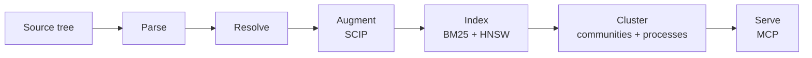
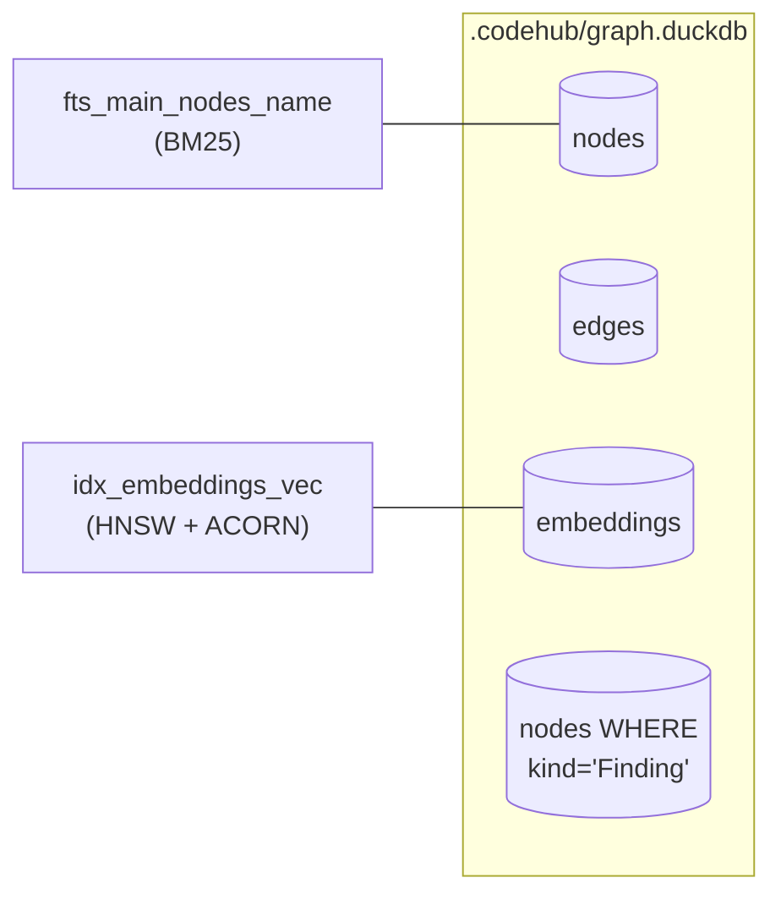

OpenCodeHub turns a source tree into a typed graph that agents can
query over MCP. The pipeline has six phases, and each phase has one
job. This page is the index. Each section names a phase, states its
one job, and links to the page that covers it in depth.

## Pipeline at a glance

Fifteen tree-sitter grammars produce a unified `ParseCapture` stream.
Per-language resolvers turn captures into typed relations. Five SCIP
indexers upgrade heuristic edges to compiler-grade references where
available. DuckDB persists the graph, BM25, and HNSW in one embedded
file. Communities and processes are precomputed. An stdio MCP server
answers agent queries.

## Where the data lives

Every tier — symbol, file, community — lives in one `embeddings`
table keyed by a `granularity` discriminator, so one HNSW index serves
all three. Findings reuse the `nodes` table with `kind='Finding'`.

## The six phases

### 1. Parse — source tree to captures

One job: lex every file with its tree-sitter grammar and emit a
`ParseCapture[]` stream in a unified schema (tag, text, start/end
line+col, nodeType). Lines are 1-indexed, columns 0-indexed.

Fifteen languages are registered via a compile-time exhaustive
`satisfies Record<LanguageId, LanguageProvider>` table: TypeScript,
TSX, JavaScript, Python, Go, Rust, Java, C#, C, C++, Ruby, Kotlin,
Swift, PHP, Dart.

See [Parsing and resolution](/opencodehub/architecture/parsing-and-resolution/).

### 2. Resolve — captures to typed relations

One job: turn captures into typed edges (`DEFINES`, `HAS_METHOD`,
`HAS_PROPERTY`, `IMPORTS`, `EXTENDS`, `IMPLEMENTS`, `CALLS`) by
resolving names against a per-language symbol scope.

A three-tier resolver handles the common case (same-file 0.95,
import-scoped 0.9, global 0.5). Python and the TS family opt into a
stack-graphs backend for tighter cross-module resolution. Heritage
linearization is per-language: C3, first-wins, single-inheritance, or
no-op.

See [Parsing and resolution](/opencodehub/architecture/parsing-and-resolution/).

### 3. Augment — SCIP indexers upgrade edges

One job: run each repo's SCIP indexer, parse the resulting `.scip`
protobuf, and emit `CALLS` edges with `confidence=1.0` and
`reason=scip:<indexer>@<version>`. The `confidence-demote` phase then
rescales any heuristic edge the SCIP oracle contradicts from 0.5 to
0.2.

Five indexers: scip-typescript 0.4.0, scip-python 0.6.6, scip-go
v0.2.3, scip-java 0.12.3, rust-analyzer (stable channel). Pins live
in `.github/workflows/gym.yml`.

See [SCIP reconciliation](/opencodehub/architecture/scip-reconciliation/).

### 4. Index — BM25, HNSW, and scanners

One job: persist the graph into DuckDB with search indexes wired up.

- **`fts`** — BM25 over symbol names, docstrings, file paths.
- **`hnsw_acorn`** — filter-aware HNSW (ACORN-1 traversal, RaBitQ
  quantization, 21-30× memory reduction). `vss` is the fallback.
- **Recursive CTEs with `USING KEY`** — multi-hop graph traversal.

Embeddings are optional, gated on `PipelineOptions.embeddings`. Three
tiers (symbol, file, community) live in one table under one HNSW
index. Three backend cascades select one: ONNX local, OpenAI-compat
HTTP, or SageMaker.

Scanners run separately through the `scan` MCP tool, merging SARIF
onto disk and indexing findings back into the `nodes` table.

See [Embeddings](/opencodehub/architecture/embeddings/) and
[Scanners and SARIF](/opencodehub/architecture/scanners-and-sarif/).

### 5. Cluster — communities and processes

One job: group related symbols into communities (Louvain) and walk
call chains to produce processes (handler → service → data access).
Both are precomputed so MCP tools read them directly.

Symbol-level LLM summaries are produced here when enabled. Summaries
are fused into the symbol-tier embedding text at ingestion time (not
query time) so retrieval runs against a pre-fused vector.

See [Summarization and fusion](/opencodehub/architecture/summarization-and-fusion/).

### 6. Serve — MCP over stdio

One job: expose the graph through an stdio MCP server (`codehub
mcp`). Every tool returns a structured envelope with `next_steps` and,
when the index lags HEAD, a `_meta["codehub/staleness"]` block. No
daemon, no socket, no remote state.

See [MCP tool map](/opencodehub/mcp/tools/) for the full
tool list.

## Why this shape

OpenCodeHub's primary user is an AI coding agent that needs callers,
callees, processes, and blast radius in one tool call — and needs the
answer to be reproducible across runs. The six-phase shape is the
cheapest configuration that hits all three:

- **Local + offline.** DuckDB is embedded. Indexing reads the
  filesystem, nothing else. `codehub analyze --offline` opens zero
  sockets.
- **Deterministic.** Phases are pure: same inputs → same outputs,
  byte-identical `graphHash`. See [Determinism](/opencodehub/architecture/determinism/).
- **Apache-2.0, every transitive dep on the permissive allowlist.**
  DuckDB is MIT, `hnsw_acorn` is MIT, tree-sitter is MIT. No BSL, no
  AGPL, no source-available engines in the core. See
  [Supply chain](/opencodehub/architecture/supply-chain/).

## Reference ADRs

| ADR | Topic                                                                       |
|-----|-----------------------------------------------------------------------------|
| 0001 | Storage backend selection — why DuckDB + `hnsw_acorn` + `fts`              |
| 0002 | Rust core deferred to v2.1+ — why v2.0 stays pure TypeScript               |
| 0004 | Hierarchical embeddings — one table, three granularities, filter-aware HNSW |
| 0005 | SCIP replaces LSP — compiler-grade edges without long-running language servers |
| 0006 | SCIP indexer CI pins — current version table per language                  |

See [ADRs](/opencodehub/architecture/adrs/) for the full list and
decisions.

## Related pages

- [Monorepo map](/opencodehub/architecture/monorepo-map/) — every
  workspace package and what it owns.
- [Determinism](/opencodehub/architecture/determinism/) — the
  reproducibility contract and how it is tested.
- [Supply chain](/opencodehub/architecture/supply-chain/) — SBOM,
  license allowlist, vulnerability posture.
