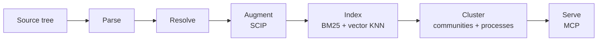
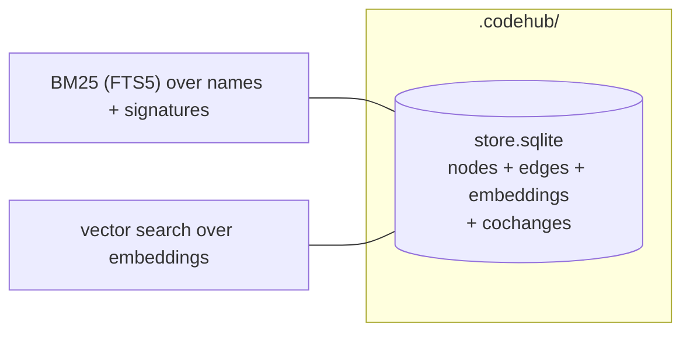

OpenCodeHub turns a source tree into a typed graph that agents can
query over MCP. The pipeline has six phases, and each phase has one
job. This page is the index. Each section names a phase, states its
one job, and links to the page that covers it in depth.

## Pipeline at a glance

Fifteen tree-sitter grammars produce a unified `ParseCapture` stream.
Per-language resolvers turn captures into typed relations. SCIP
indexers (TypeScript, Python, Go, Rust, Java, C#, C/C++, Kotlin,
Ruby) upgrade heuristic edges to compiler-grade references where
available. The whole index persists into one `store.sqlite` file via
Node's built-in `node:sqlite`. Communities and
processes are precomputed. An stdio MCP server with 29 tools answers
agent queries.

## Where the data lives

The entire index lives in one **`store.sqlite`** file (WAL mode) under
`.codehub/`, via Node's built-in `node:sqlite`. It holds graph nodes,
edges, embeddings, the FTS5 search index, and the temporal tables
(cochanges). There is no selection knob, no native
binding, and no fallback: ADR 0019 removed both `@ladybugdb/core` and
`@duckdb/node-api`, leaving zero native storage bindings. See
[Storage backend](/opencodehub/architecture/storage-backend/).

Embeddings live in the same `store.sqlite` file as the graph (one
`embeddings` table, three granularities keyed by a
`granularity` discriminator). Findings reuse the `nodes` table with
`kind='Finding'`.

## The six phases

### 1. Parse — source tree to captures

One job: lex every file with its tree-sitter grammar and emit a
`ParseCapture[]` stream in a unified schema (tag, text, start/end
line+col, nodeType). Lines are 1-indexed, columns 0-indexed.

Fifteen languages are registered via a compile-time exhaustive
`satisfies Record<LanguageId, LanguageProvider>` table: TypeScript,
TSX, JavaScript, Python, Go, Rust, Java, C#, C, C++, Ruby, Kotlin,
Swift, PHP, Dart. The runtime is `web-tree-sitter` (WASM), the only
parse runtime on Node ≥24.15. There is no native parser and no
opt-in (ADR 0015).

See [Parsing and resolution](/opencodehub/architecture/parsing-and-resolution/).

### 2. Resolve — captures to typed relations

One job: turn captures into typed edges (`DEFINES`, `HAS_METHOD`,
`HAS_PROPERTY`, `IMPORTS`, `EXTENDS`, `IMPLEMENTS`, `CALLS`,
`REFERENCES`, `TYPE_OF`) by resolving names against a per-language
symbol scope.

A three-tier resolver handles the common case (same-file 0.95,
import-scoped 0.9, global 0.5). Python and the TS family opt into a
stack-graphs backend for tighter cross-module resolution. Heritage
linearization is per-language: C3, first-wins, single-inheritance, or
no-op.

See [Parsing and resolution](/opencodehub/architecture/parsing-and-resolution/).

### 3. Augment — SCIP indexers upgrade edges

One job: run each repo's SCIP indexer, parse the resulting `.scip`
protobuf, and emit `CALLS`, `REFERENCES`, `IMPLEMENTS`, and `TYPE_OF`
edges with `confidence=1.0` and `reason=scip:<indexer>@<version>`. The
`confidence-demote` phase then rescales any heuristic edge the SCIP
oracle contradicts from 0.5 to 0.2.

Pinned indexers cover TypeScript / TSX / JavaScript (scip-typescript),
Python (scip-python), Go (scip-go), Rust (rust-analyzer), Java
(scip-java), C# (scip-dotnet), C/C++ (scip-clang), Kotlin (scip-kotlin),
and Ruby (scip-ruby). Pins live in `.github/workflows/gym.yml`.

See [SCIP reconciliation](/opencodehub/architecture/scip-reconciliation/).

### 4. Index — BM25, vector KNN, and scanners

One job: persist the graph into `store.sqlite` with search indexes wired up.

- **BM25** — over symbol names and signatures via an FTS5
  virtual table.
- **Vector search** — filter-aware, with the granularity discriminator
  pushed into the predicate so all three tiers (symbol / file /
  community) share one `embeddings` table without recall collapse.
- **Multi-hop traversal** — recursive CTEs over the `edges` table for
  impact and blast-radius.

Embeddings are optional, gated on `PipelineOptions.embeddings`. The
backend cascade is SageMaker → HTTP / OpenAI-compatible → local ONNX.

Scanners run separately through the `scan` MCP tool, merging SARIF
onto disk and indexing findings back into the `nodes` table.

See [Embeddings](/opencodehub/architecture/embeddings/) and
[Scanners and SARIF](/opencodehub/architecture/scanners-and-sarif/).

### 5. Cluster — communities and processes

One job: group related symbols into communities (Louvain) and walk
call chains to produce processes (handler → service → data access).
Both are precomputed so MCP tools read them directly.

### 6. Serve — MCP over stdio

One job: expose the graph through an stdio MCP server (`codehub
mcp`). Twenty-nine tools, seven resources, zero canned prompts. Every
tool returns a structured envelope with `next_steps` and, when the
index lags HEAD, a `_meta["codehub/staleness"]` block. No daemon, no
socket, no remote state.

See [MCP overview](/opencodehub/mcp/overview/) and
[MCP tools](/opencodehub/mcp/tools/).

## Why this shape

OpenCodeHub's primary user is an AI coding agent that needs callers,
callees, processes, and blast radius in one tool call — and needs the
answer to be reproducible across runs. The six-phase shape is the
cheapest configuration that hits all three:

- **Local + offline.** The default storage stack is embedded;
  `codehub analyze --offline` opens zero sockets.
- **Deterministic.** Phases are pure: same inputs → same outputs,
  byte-identical `graphHash`. The `graphHash` invariant holds over the
  graph nodes and edges in `store.sqlite`. See
  [Determinism](/opencodehub/architecture/determinism/).
- **Apache-2.0, every transitive dep on the permissive allowlist.**
  No BSL, no AGPL, no source-available engines in the core. See
  [Supply chain](/opencodehub/architecture/supply-chain/).

## Reference ADRs

| ADR | Topic |
|---|---|
| 0001 | Storage backend selection — the v1.0 embedded baseline. **Superseded by later storage ADRs.** |
| 0002 | Rust core deferred — v2.0 stays pure TypeScript. |
| 0004 | Hierarchical embeddings — one table, three granularities, filter-aware vector search. |
| 0005 | SCIP replaces LSP — compiler-grade edges without long-running language servers. |
| 0006 | SCIP indexer CI pins — current version table per language. |
| 0007–0010 | Artifact factory, document pattern, output conventions, dogfood findings. |
| 0011 | Graph-native backend (phase-1) behind the `IGraphStore` seam. |
| 0012 | Repo as a first-class graph node — `repo_uri`, group registry, `AMBIGUOUS_REPO` envelope. |
| 0013 (storage) | M7 default-flip + interface segregation. **Superseded by 0019.** |
| 0013 (parse) | WASM-default parse runtime, native opt-in. **Superseded by 0015.** |
| 0014 | SCIP REFERENCES + TYPE_OF emission, embedder modelId stamping. |
| 0015 | WASM-only parser — `web-tree-sitter` is the only runtime on Node ≥24.15; native opt-in removed. |
| 0016 | Graph-backend rip-out, segregated interfaces preserved. **Superseded by 0019.** |
| 0017 | Drop detect-secrets — ship a tuned betterleaks default config. |
| 0018 | Cleanroom provenance of the route / tool / contract tool names. |
| 0019 | Single-file SQLite storage — one `store.sqlite` via `node:sqlite`; both native storage bindings removed. Supersedes 0016. |
| 0020 | Decision-equivalence is the pack contract; byte-identity is a witness, not the contract. |

See [ADRs](/opencodehub/architecture/adrs/) for the full list.

## Related pages

- [Monorepo map](/opencodehub/architecture/monorepo-map/) — every
  workspace package and what it owns.
- [Storage backend](/opencodehub/architecture/storage-backend/) — the
  single `store.sqlite` file and the `IGraphStore` / `ITemporalStore`
  interface segregation.
- [Cross-repo federation](/opencodehub/architecture/cross-repo-federation/)
  — `repo_uri`, the group registry, and the `AMBIGUOUS_REPO` envelope.
- [Determinism](/opencodehub/architecture/determinism/) — the
  reproducibility contract.
- [Supply chain](/opencodehub/architecture/supply-chain/) — SBOM,
  cosign, SLSA L3, license allowlist.
