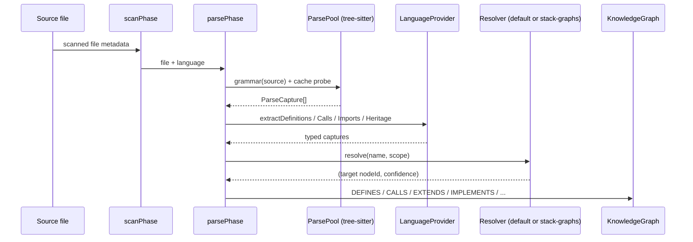

This page covers phases 1 and 2 of the pipeline: from source files to
typed `CALLS` / `EXTENDS` / `IMPLEMENTS` / `FETCHES` / `ACCESSES`
edges on the graph. The goal is to explain the moving parts —
grammars, the provider registry, resolver flavors, and import
semantics — well enough that adding a new language is a mechanical
exercise.

## The tree-sitter layer

Fifteen grammars are pinned through `packages/ingestion/package.json`
and loaded by a worker pool that clamps to `max(2, min(cpus, 8))`
threads. Each file is hashed and the resulting `ParseCapture[]` is
cached keyed on `(sha256, grammarSha, SCHEMA_VERSION)`, so a subsequent
analyze with the same content skips tree-sitter entirely.

`ParseCapture` is the shared per-capture schema emitted by the worker
— one interface with 7 readonly fields:

```ts
interface ParseCapture {
  readonly tag: string;        // e.g. "definition.function"
  readonly text: string;
  readonly startLine: number;  // 1-indexed
  readonly endLine: number;
  readonly startCol: number;   // 0-indexed
  readonly endCol: number;
  readonly nodeType: string;
}
```

The tag vocabulary is a clean-room set (`definition.*`,
`reference.*`, `doc`, `name`) that decouples the downstream providers
from each grammar's internal node naming.

## The language provider registry

Providers are registered via a compile-time exhaustive table:

```ts
export const PROVIDERS = {
  typescript: typescriptProvider,
  tsx: tsxProvider,
  javascript: javascriptProvider,
  python: pythonProvider,
  go: goProvider,
  rust: rustProvider,
  java: javaProvider,
  csharp: csharpProvider,
  c: cProvider,
  cpp: cppProvider,
  ruby: rubyProvider,
  kotlin: kotlinProvider,
  swift: swiftProvider,
  php: phpProvider,
  dart: dartProvider,
} satisfies Record<LanguageId, LanguageProvider>;
```

The `satisfies` clause is load-bearing: if `LanguageId` gains a new
member and the table does not, the build fails. `getProvider(lang)`
and `listProviders()` are the two helpers the pipeline uses to reach
providers without hard-coding names.

Each `LanguageProvider` exposes six hooks — `extractDefinitions`,
`extractCalls`, `extractImports`, `extractHeritage`,
`detectOutboundHttp`, `extractPropertyAccesses` — plus configuration
fields (`importSemantics`, `mroStrategy`, optional
`resolverStrategyName`).

## Per-language resolvers

Name resolution runs in two tiers. The default walker resolves a
reference against three scopes in order:

| Scope        | Confidence |
|--------------|------------|
| Same file    | 0.95       |
| Import-scoped| 0.9        |
| Global       | 0.5        |

Heritage linearization — which matters when `super.foo()` can come
from any of several bases — is selected per language. Four flavors:

| Strategy             | Languages                                           |
|----------------------|-----------------------------------------------------|
| `c3`                 | Python, Kotlin, Dart, C++, Ruby                     |
| `first-wins`         | TypeScript, TSX, JavaScript, Rust                   |
| `single-inheritance` | Java, C#, PHP, Swift                                |
| `none`               | Go, C                                               |

The `STRATEGIES` record in `providers/resolution/mro.ts` is the source
of truth; each provider declares `mroStrategy: MroStrategyName` and
the resolver dispatches on it.

## Import-semantic taxonomy

The provider contract enforces one of three import semantics:

| Value              | What it means                                       | Example languages     |
|--------------------|-----------------------------------------------------|-----------------------|
| `named`            | Imports bring specific names into scope.            | TS/TSX/JS, Rust, Java, C# |
| `namespace`        | Imports bring a namespace; members accessed via dot.| Python                |
| `package-wildcard` | Whole package is re-exported as one bag.            | Go, Kotlin            |

The `package-wildcard` value has a concrete consequence: the resolver
does not chase cross-module names through the import, because the
package re-exports everything and the exact origin file is undecidable
from the import site alone. Go's `import "fmt"` followed by
`fmt.Println` does not tell the resolver which file inside `fmt`
defines `Println`; the SCIP augmenter fills that in when present.

## What captures become

Parse emits five edge types directly (`DEFINES`, `HAS_METHOD`,
`HAS_PROPERTY`, `IMPORTS`, `EXTENDS`, `IMPLEMENTS`, `CALLS`). Two
more edge types come from later dedicated phases:

- **`ACCESSES`** (read/write) — emitted by the `accesses` phase from
  `extractPropertyAccesses` captures. When no matching field is
  found, a synthetic `Property:unresolved:<name>` stub anchors the
  edge rather than dropping it. Intentional anchoring, not a bug.
- **`FETCHES`** — emitted by the `fetches` phase from
  `detectOutboundHttp` captures. When no local `Route` matches the
  URL pattern, the edge targets `fetches:unresolved:<id>` pseudo-nodes
  that `group_contracts` recognizes for cross-repo contract mapping.

## Stack-graphs opt-in

Four providers opt into the stack-graphs resolver by setting
`resolverStrategyName: "stack-graphs"`:

| Provider   | Default resolver confidence gain |
|------------|----------------------------------|
| typescript | Tighter cross-file lookup        |
| tsx        | Same as typescript               |
| javascript | Same as typescript               |
| python     | Attribute resolution across modules |

Stack-graphs adds incremental, precise name-binding over the
heuristic three-tier walker — it models scope, inheritance, and
imports as a graph whose path-finding produces a deterministic binding.
The other 11 providers fall back to the default walker, which is
cheaper and good enough given that SCIP is expected to augment the
compiled languages.

## The flow, end-to-end



Stack-graphs-enabled providers route through the
`stackGraphsRouter` side of `getResolver()` instead of the default
walker; the rest of the pipeline is unchanged.

## Gotchas

- **Properties without a matching field produce synthetic
  `Property:unresolved:<name>` stubs**, not dropped edges. Queries
  that BM25-rank over node IDs will see these stubs compete with real
  symbols. See the durable lesson linked below.
- **`FETCHES` without a local route emit to `fetches:unresolved:<id>`
  pseudo-targets**. These are recognized by `group_contracts` when
  fanning out cross-repo contract analysis.
- **`DEBUG_PHASE_MEM=1`** brackets `graphHash` with stderr telemetry
  for memory profiling.
- **`PipelineOptions.force`** bypasses parse-cache lookups (still
  writes fresh entries). Useful for debugging but not day-to-day.

## Further reading

- [Adding a language provider](/opencodehub/contributing/adding-a-language-provider/)
  — the step-by-step contract for adding a 16th language.
- [SCIP reconciliation](/opencodehub/architecture/scip-reconciliation/)
  — how compiler-grade edges demote heuristic ones.
- Durable lesson: `conventions/bm25-over-node-id-favors-stubs.md` —
  why BM25 over node IDs needs to be gated against unresolved stubs.
