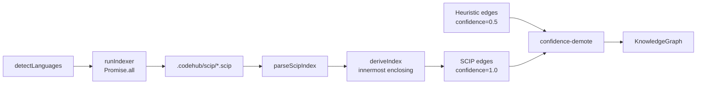

SCIP is the augmenter, not the primary. OpenCodeHub's default
resolver produces a graph on its own; SCIP then runs for each
detected language, produces compiler-grade occurrences, and
reconciles against the heuristic edges. Heuristic edges never get
deleted — they get demoted. This page covers the ingest path,
reconciliation, and the corners that took a few iterations to get
right.

## Why SCIP is an augmenter

Three reasons SCIP does not replace the default resolver:

- **Not every language has an indexer**, and the indexers that exist
  have different install paths and runtime expectations.
- **SCIP requires a buildable repo.** Missing dependencies, unsettable
  credentials, or a half-written feature branch all make the indexer
  fall over. The heuristic resolver still produces a usable graph.
- **Rust, Java, and the JVM-driven indexers need build scripts to
  run.** Build-script execution is gated behind
  `CODEHUB_ALLOW_BUILD_SCRIPTS=1`. Heuristic parsing is always safe.

SCIP contributes `CALLS`, `REFERENCES`, `IMPLEMENTS`, and `TYPE_OF`
edges with `confidence=1.0` — the oracle tier — and the reconciliation
phase rescales any colliding heuristic edge to `confidence=0.2` with a
`+scip-unconfirmed` suffix on the reason. The REFERENCES + TYPE_OF
emission landed in ADR 0014.

## Indexer inventory

| Indexer | Languages | Install channel |
|---|---|---|
| `scip-typescript` | TypeScript, TSX, JavaScript | `npm install -g @sourcegraph/scip-typescript` |
| `scip-python` | Python | `uv tool install scip-python` |
| `scip-go` | Go | `go install github.com/scip-code/scip-go/cmd/scip-go@<pin>` |
| `rust-analyzer` | Rust | `rustup component add rust-analyzer rust-src` |
| `scip-java` | Java | `coursier install scip-java` |
| `scip-dotnet` | C# | `dotnet tool install --global scip-dotnet` |
| `scip-clang` | C, C++ | Vendor binary; consumes a JSON compilation database. |
| `scip-kotlin` | Kotlin | `scip-kotlin@^0.6.0` (requires Kotlin 2.2+). |
| `scip-ruby` | Ruby | `scip-ruby` via gem; reads `sorbet/config` if present. |

Pins live in `.github/workflows/gym.yml` so gym replay catches drift.
ADR 0006 covers the rationale for individual pins and install
channels.

## The `.scip` ingest path

`@opencodehub/scip-ingest` hand-rolls the protobuf reader (~130 LOC)
instead of pulling in buf plus codegen — the SCIP schema is small
enough that the extra build-time dependency is not worth the
maintenance burden. The public API is narrow: `parseScipIndex`,
`deriveIndex`, `deriveEdges`, `buildSymbolDefIndex`, `materialize`,
`runIndexer`, `detectLanguages`, `scipProvenanceReason`.

The phase flow:

1. `detectLanguages(repo)` — fs-based heuristic (tsconfig.json,
   pyproject.toml, go.mod, Cargo.toml, pom.xml / build.gradle /
   build.sbt).
2. For each detected language, `runIndexer()` spawns the per-language
   binary and writes `.codehub/scip/<kind>.scip`. Fan-out uses
   `Promise.all`; a per-language failure never aborts the run.
3. `parseScipIndex` decodes the protobuf into typed wire shapes.
4. `deriveIndex` + `deriveEdges` attribute each occurrence to a caller
   (via innermost-enclosing `enclosing_range`) and a callee (via a
   `symbolDef` table keyed on `SCIP_ROLE_DEFINITION` occurrences).
5. `emitEdges()` writes `CALLS` edges with `confidence=1.0` and
   `reason=scip:<indexer>@<version>`.

A cached `.scip` artifact that passes the freshness check is reused;
re-running an indexer is expensive, especially rust-analyzer.

## Confidence demote

The `confidence-demote` phase runs immediately after `scip-index` and
carries three constants:

```
HEURISTIC_CONFIDENCE = 0.5
DEMOTED_CONFIDENCE   = 0.2
ORACLE_CONFIDENCE    = 1.0
UNCONFIRMED_SUFFIX   = "+scip-unconfirmed"
```

It iterates edges twice: first to build the set of
`(from, type, to)` triples that SCIP has confirmed, second to demote
any matching heuristic edge. Three edge types are demotable: `CALLS`,
`REFERENCES`, `EXTENDS`. The demoted edge keeps its original reason
with the `+scip-unconfirmed` suffix so provenance is visible.

The invariant: **SCIP replaces (never rejects) heuristic edges —
demote only, do not delete**. Downstream consumers can still filter
on confidence; the information is not lost.

## Provenance tagging

Every oracle-derived edge carries a reason of the form
`scip:<indexer>@<version>`, e.g. `scip:scip-python@0.6.6`. The
prefix set is declared once in `@opencodehub/core-types` and consumers
(summarizer trust filter, `verdict`, MCP tools) test against the
exported list rather than string-matching ad hoc. New indexers
(scip-clang, scip-dotnet, scip-kotlin, scip-ruby) are appended to the
same list as they land.

## The pipeline slice



`reconcile` is the phase that makes heuristic and oracle edges
coherent. Only `CALLS` edges currently flow from SCIP (see
limitations below).

## Known gotchas

The design has been shaped by four durable lessons. Each one is a
concrete bug that was found, fixed, and captured:

- **Callee resolution must go through `symbolDef` keyed on
  `SCIP_ROLE_DEFINITION`.** Resolving a callee from the first-seen
  call site routes same-named symbols to wrong local nodes — a
  Python method named `save` in multiple classes all collapse onto
  whichever `save()` call happened first in the file. The
  `buildSymbolDefIndex` path is the fix. See durable lesson
  `architecture-patterns/scip-callee-definition-site.md`.
- **TS monorepos emit `dist/` paths in cross-package refs and `src/`
  paths in defs.** The `symbolDef` table aliases the two so a
  reference to `@acme/core/dist/foo.js` binds to its definition in
  `packages/core/src/foo.ts`. See durable lesson
  `architecture-patterns/scip-monorepo-dist-src-alias.md`.
- **SCIP is 0-indexed, the graph is 1-indexed.** The `+1`
  conversion lives at the boundary in `scip-index.ts`. Getting this
  wrong shifts every caller attribution by one line. See durable
  lesson `conventions/scip-0-indexed-vs-graph-1-indexed.md`.
- **The protobuf reader is hand-rolled on purpose.** SCIP's schema
  is small and stable; pulling in buf plus codegen would pay a
  recurring build-time cost for decoding logic that fits in 130
  lines. See durable lesson
  `conventions/scip-protobuf-hand-rolled-reader.md`.

## Status

Both `REFERENCES` and `TYPE_OF` are now emitted from SCIP alongside
`CALLS` and `IMPLEMENTS`. ADR 0014 describes the wire-up that landed
the missing edge classes plus the embedder-modelId fingerprint
refusal at query time.

## Configuration knobs

- `CODEHUB_DISABLE_SCIP=1` — the phase is a full no-op.
- `CODEHUB_ALLOW_BUILD_SCRIPTS=1` — required for the rust + java
  runners (build.rs, gradle).
- `PipelineOptions.offline === true` — skips indexer runs entirely;
  cached `.scip` artifacts are still consumed if present.

## Further reading

- [ADR 0005 — SCIP replaces LSP](https://github.com/theagenticguy/opencodehub/blob/main/docs/adr/0005-scip-replaces-lsp.md)
  — why SCIP (no long-running language server) over LSP.
- [ADR 0006 — SCIP indexer pins](https://github.com/theagenticguy/opencodehub/blob/main/docs/adr/0006-scip-indexer-pins.md)
  — the version table and rationale.
- [Determinism](/opencodehub/architecture/determinism/) — gym replay
  catches indexer drift before it lands in main.
- Durable lessons: `architecture-patterns/scip-replaces-lsp.md`,
  `architecture-patterns/scip-callee-definition-site.md`,
  `architecture-patterns/scip-monorepo-dist-src-alias.md`,
  `conventions/scip-0-indexed-vs-graph-1-indexed.md`,
  `conventions/scip-protobuf-hand-rolled-reader.md`.
