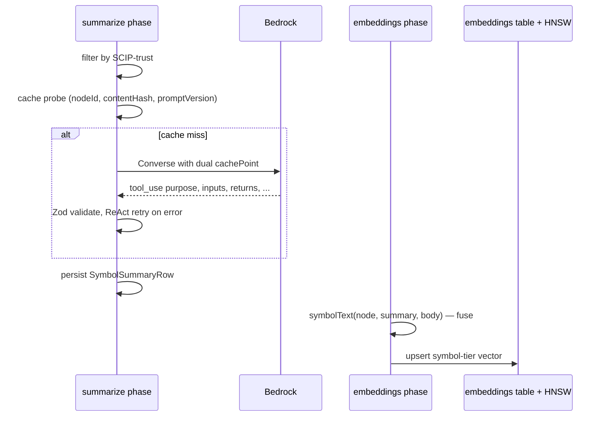

`@opencodehub/summarizer` produces per-symbol natural-language
summaries grounded in source. The ingestion `summarize` phase
persists them; the downstream `embeddings` phase fuses each summary
into the symbol-tier embedding text so retrieval runs against a
pre-fused vector.

This page covers the schema, the Bedrock caching shape, the ReAct
retry loop, and where fusion happens.

## Schema

`SymbolSummary` is a Zod 4 schema with strict field bounds and a
SuperRefine that enforces citation completeness — every populated
field must carry ≥1 citation.

| Field         | Shape                                                           |
|---------------|-----------------------------------------------------------------|
| `purpose`     | string (30-400 chars); becomes `summaryText` in the row.        |
| `inputs`      | `InputSpec[]`: name + type + description per input.             |
| `returns`     | `{type, type_summary (10-80), details (20-400)}`.               |
| `side_effects`| array; each entry contains one of `reads|writes|emits|raises|mutates`. |
| `invariants`  | array (nullable).                                               |
| `citations`   | ≥1; each has `field_name` enum + `line_start` + `line_end`.     |

`buildToolInputSchema()` runs `z.toJSONSchema(SymbolSummary)` and
strips `$schema` before handing it to Bedrock — any post-processing
that re-adds `$schema` breaks the cacheable prefix. A runtime
`validateCitationLines()` pass checks every citation range sits
inside the source span.

## Model + caching

Two constants govern the model choice:

```
DEFAULT_MODEL_ID = "global.anthropic.claude-haiku-4-5-20251001-v1:0"
DEFAULT_MAX_ATTEMPTS = 3
```

`summarizeSymbol(client, input, options)` issues a Bedrock
`ConverseCommand` with structured output via tool use. Key knobs:

- `toolChoice` is forced to `emit_symbol_summary` — the model MUST
  call this tool; a text-only response is a retry.
- `inferenceConfig = {temperature: 0, maxTokens: 2048}`.
- `cachePoint` is placed **twice**: after the system prompt, and
  after the tool spec inside `toolConfig.tools`.

The dual `cachePoint` placement matters because Haiku 4.5's
cacheable-prefix floor is 4,096 tokens. `SYSTEM_PROMPT` is sized to
clear that floor with three worked examples baked in (`normalize_path`
as a pure function, `register_handler` as a side-effectful handler,
`LRUCache` as a constructor). The tool spec's cache point covers the
JSON Schema itself, which is stable as long as `$schema` is stripped
and `SUMMARIZER_PROMPT_VERSION` is unchanged.

## ReAct retry

The retry loop handles two failure modes:

- **Schema-invalid tool call.** The model returns a tool use that
  fails Zod validation. The Zod error text is fed back as
  `toolResult(status: "error")` and the model retries.
- **No tool call at all.** The model returned text only. Same fix —
  feed back an error and retry.

`maxAttempts=3` is the default; three tries is enough in practice. A
third failure throws `SummarizerError` to the caller.

## Ingestion invocation

The ingestion call site is
`packages/ingestion/src/pipeline/phases/summarize.ts`. Its deps
include `confidence-demote`, so the trust filter (SCIP-touched
symbols only) sees finalized confidence scores.

The phase applies four gates in strict order:

1. **Offline** — `PipelineOptions.offline === true` is a hard no-op.
2. **Flag** — `PipelineOptions.summaries === true` required.
3. **Trust filter** — only symbols touched by a SCIP oracle
   (confidence 1.0 with a reason prefixed by `scip:`) are candidates.
   A repo without SCIP produces zero summaries even with
   `summaries=true`.
4. **Cost cap** — `maxSummariesPerRun` (default 0) slices the
   candidate list. A default run is a dry-run: it counts
   `wouldHaveSummarized` without issuing a single Bedrock call.

Reordering any gate silently changes cost behavior, so the order is
deliberately rigid. See the phase docstring for the full precedence
contract.

Credential soft-fail is handled twice — once on client factory
construction, once on the first `send()` — so an SSO token that
expires mid-run produces `skippedReason: "no-credentials"` rather
than an uncaught exception.

Successful rows persist as `SymbolSummaryRow`:
`{nodeId, contentHash, promptVersion, modelId, summaryText,
signatureSummary, returnsTypeSummary, createdAt}`.

## Fusion at ingestion, not query time

This is the bit to internalize: **fusion happens at ingestion, not at
query**. When the `embeddings` phase builds a symbol's vector, it
calls `symbolText(node, summary, body)`. If a summary row exists,
the embedded text is:

```
<signatureSummary or head>\n<summaryText>\n<bodyPiece>
```

with `bodyPiece` capped at `SYMBOL_BODY_CHAR_CAP = 1200`. Without a
summary, the fallback is `<head>\n<description>`.

The resulting vector already encodes the signature, the summary, and
the body. Retrieval does not re-fuse at query time — it searches
against the pre-fused vector. This keeps query latency low and keeps
the query path free of LLM calls.



## Cache-key discriminator

The cache key is `(nodeId, contentHash, promptVersion)`:

- `contentHash` is `sha256` of the raw UTF-8 span `[startLine,
  endLine]`. A whitespace-only edit inside the span changes the hash
  and invalidates the cached summary for that symbol.
- `promptVersion` is `SUMMARIZER_PROMPT_VERSION = "1"`. Bumping this
  constant invalidates every cached summary in one shot — the
  prior rows survive in the cache (no deletion), but lookups miss.
  Planned rollout is the new version coexisting with the old so a
  rollback is cheap.

## Cost profile

Haiku 4.5 calls happen once per callable symbol at ingest time. A
re-ingest without a prompt-version bump is a cache hit. With the
default `maxSummariesPerRun=0`, the phase never contacts Bedrock —
the dry-run mode is the production default until an operator opts in.

## Configuration knobs

- `PipelineOptions.summaries: boolean` — master enable (default
  false).
- `PipelineOptions.maxSummariesPerRun` — default 0 (dry-run). Counts
  `wouldHaveSummarized` without calling Bedrock.
- `PipelineOptions.summaryModel` — override the default model id.
- `SummarizeOptions.maxAttempts` (default 3) / `maxTokens` (default
  2048).
- AWS SDK credentials via default chain — expired SSO soft-fails to
  `skippedReason: "no-credentials"`.

## Gotchas

- **Trust filter excludes non-SCIP repos.** A repo without any SCIP
  indexer configured produces zero summaries because no symbol is
  SCIP-confirmed. This is intentional: summaries over uncertain
  edges would pollute the downstream retrieval vector.
- **Whitespace-only edits bust the cache.** `contentHash` is over
  the raw span, not a normalized form. A reformatter run will
  re-summarize every touched symbol. This is a deliberate trade —
  normalization would require per-language logic and is not worth it
  for a once-per-symbol call.
- **`signatureSummary` appears in both `SymbolSummaryRow` and
  `SearchResult`.** The two are populated by different paths: the
  summarize phase writes one, the MCP query layer post-joins the
  other. Storage-layer `search()` never fills it directly.

## Further reading

- [Embeddings](/opencodehub/architecture/embeddings/) — where the
  symbol-tier fused text lands.
- [SCIP reconciliation](/opencodehub/architecture/scip-reconciliation/)
  — the trust filter source.
- `@opencodehub/summarizer` package README — the schema field
  bounds in one page.
