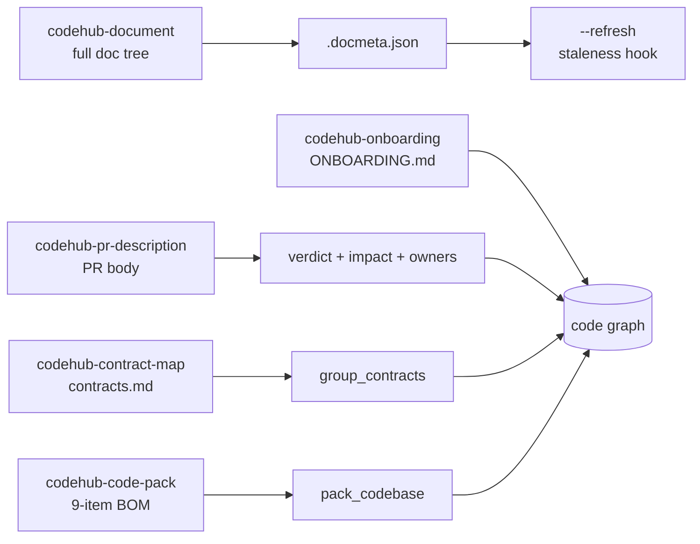

import { Card, CardGrid, LinkCard } from "@astrojs/starlight/components";

The `opencodehub` Claude Code plugin ships two families of skills:

- **Analysis skills** (pre-existing) — `codehub-exploring`, `codehub-impact-analysis`, `codehub-debugging`, `codehub-refactoring`, `codehub-pr-review`, `codehub-guide`. These answer questions about the code graph.
- **Artifact skills** (new in this release) — turn graph queries into committed Markdown. Documented below.

All artifact skills ship under `plugins/opencodehub/skills/` and are
auto-discovered by Claude Code when the plugin is installed.

## Artifact skills

<CardGrid>
  <LinkCard
    title="codehub-document"
    description="Primary artifact generator. Single-repo and group mode, 4-phase orchestration, .docmeta.json sidecar."
    href="/opencodehub/skills/codehub-document/"
  />
  <LinkCard
    title="codehub-pr-description"
    description="Draft a PR body from detect_changes + verdict + owners + findings-delta. Refuses on a clean tree."
    href="/opencodehub/skills/codehub-pr-description/"
  />
  <LinkCard
    title="codehub-onboarding"
    description="ONBOARDING.md with a graph-centrality-ranked reading order and an end-to-end process walk."
    href="/opencodehub/skills/codehub-onboarding/"
  />
  <LinkCard
    title="codehub-contract-map"
    description="Group-only. Consumer/producer contract matrix across a repo group, with Mermaid flow."
    href="/opencodehub/skills/codehub-contract-map/"
  />
  <LinkCard
    title="codehub-code-pack"
    description="Deterministic 9-item code-pack BOM for a repo or group — byte-identical given the same (commit, tokenizer, budget)."
    href="/opencodehub/skills/codehub-code-pack/"
  />
</CardGrid>

## How they compose

The five skills share the OpenCodeHub MCP toolkit. `codehub-document` is
the only skill that dispatches subagents; the others are linear. The four
documentation skills write to `.codehub/` by default (gitignored), with
`--committed` opting in to a git-tracked path; `codehub-code-pack` writes
a deterministic code-pack BOM via `pack_codebase`.

## Invocation cheatsheet

| Trigger phrase | Fires |
|---|---|
| "document this repo" / "regenerate the architecture docs" | `codehub-document` |
| "document the `<group>` group" / "map the repos in `<group>`" | `codehub-document --group <name>` |
| "write the PR description" / "summarize this branch for review" | `codehub-pr-description` |
| "draft release notes for HEAD" | `codehub-pr-description` |
| "write ONBOARDING.md" / "what should a new hire read first" | `codehub-onboarding` |
| "map the contracts" / "show the contract matrix for `<group>`" | `codehub-contract-map <group>` |
| "pack this repo for an LLM" / "deterministic code pack" | `codehub-code-pack` |

## Discoverability hooks

The plugin hooks have been extended to surface the artifact skills at the
right moments:

- After `codehub analyze` completes, the CLI prints:
  `Try: /codehub-document · /codehub-onboarding · /codehub-contract-map <group>`
- After `git commit|merge|rebase|pull` triggers auto-reindex, if
  `.codehub/docs/.docmeta.json` exists and its `codehub_graph_hash` differs
  from the live hash, a non-blocking `systemMessage` suggests
  `/codehub-document --refresh`. **Never auto-regenerates** — regeneration
  spends LLM credits and requires user consent.
- `mcp__opencodehub__verdict` and `mcp__opencodehub__detect_changes`
  responses include `next_steps: [{suggest: "codehub-pr-description"}]`
  when a non-empty diff is present.
