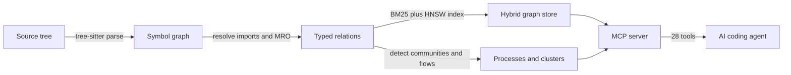

AI coding agents have a structural blind spot. They can read a file, but
they can't see the graph the file lives in. That blind spot produces
three failure modes every agent-driven workflow eventually hits:

- **Missed dependencies.** The agent renames a function and leaves
  callers untouched, because `grep` found a fraction of the call sites.
- **Broken call chains.** The agent changes a return shape, a handler
  two hops downstream crashes at runtime, and neither the agent nor its
  tests flag it. The relationship was never in context.
- **Blind edits.** The agent rewrites a critical-path function without
  knowing it sits on the hot path of multiple production flows, because
  nothing computed that ahead of time.

Grep is textual. Language servers are per-file. Embeddings are lossy.
None of them answer the questions an agent needs answered *before* it
writes a diff: what breaks if I change this, what depends on this, and
where does this data flow.

## The graph-first approach

OpenCodeHub parses your repository with tree-sitter (15 GA languages,
plus SCIP indexers for TypeScript, Python, Go, Rust, and Java),
resolves imports and inheritance, and materialises a **typed symbol
graph**. That graph is stored in LadybugDB, a graph-native database,
with DuckDB carrying the temporal sibling (cochanges and the
symbol-summary cache). Both tiers are always present — there is no
backend toggle, and a failure to load the `@ladybugdb/core` binding
aborts the operation rather than falling back. BM25 lexical search and
filter-aware HNSW vector search sit on the same store. A local MCP
server exposes the graph to any agent that speaks Model Context
Protocol.

Clustering, execution-flow tracing, and blast-radius analysis all happen
once at index time. Agents get complete relational context in one tool
call, not ten round-trips.

## What you get in v1

- **Graph-native storage.** LadybugDB is the graph tier and a dedicated
  DuckDB sibling serves the temporal store. Both files (`graph.lbug` +
  `temporal.duckdb`) are written on every index — no backend knob, no
  fallback layout (ADR 0016).
- **Cross-repo federation.** Group several indexed repos with `codehub
  group` and query them through the `group_*` MCP tools. The repo is a
  first-class graph node and `repo_uri` carries through every
  cross-repo response, including the `AMBIGUOUS_REPO` envelope.
- **Deterministic code-pack.** `pack_codebase` (MCP) and `codehub
  code-pack` produce a reproducible 9-item BOM signed by the release
  workflow.
- **WASM-only parsing.** `web-tree-sitter` is the only parse runtime on
  Node 20, 22, and 24, with all 15 grammar `.wasm` blobs vendored in the
  `@opencodehub/ingestion` tarball. `npm install -g @opencodehub/cli@latest`
  does zero native builds and zero GitHub fetches (ADR 0015).

## When to reach for OpenCodeHub

- **Non-trivial refactors.** Rename a function, change a return shape,
  or move a module and let the agent see every caller before it edits.
- **Cross-file changes.** Any diff that touches more than one file and
  crosses a module boundary.
- **Blast-radius questions.** "What processes depend on `validateUser`?
  What is the risk tier of this change?"
- **Onboarding to a new repo.** Ask the graph for the top clusters,
  HTTP routes, or authentication flow before the first edit.

Next, [install the CLI](/opencodehub/start-here/install/) and run your
[first query](/opencodehub/start-here/first-query/).
